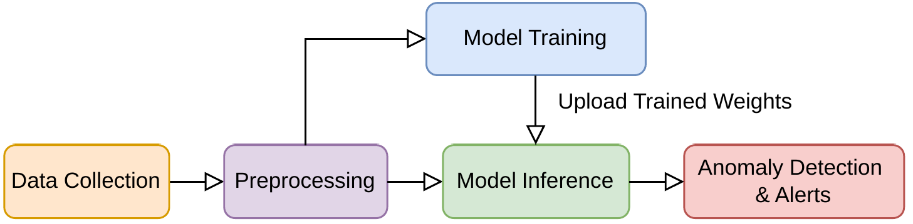

# ThermADNet: Thermal Anomaly Detection for HPC Datacenters

[](https://doi.org/10.5281/zenodo.XXXXXXX)

This repository contains the code, configurations, and data access instructions for the paper:

**Elevating Datacenter Resilience with ThermADNet: A Thermal Anomaly Detection System**  
*Mohsen Seyedkazemi Ardebili, Andrea Acquaviva, Luca Benini, Andrea Bartolini*  
_Preprint submitted to Elsevier, September 2025_

📄 [Preprint PDF](./ThermADNet_FGCS_.pdf)  
🔗 [Zenodo Dataset](https://zenodo.org/record/XXXXXXX)  

---

## 📌 Overview

ThermADNet is a **thermal anomaly detection framework** for High-Performance Computing (HPC) datacenters.  
It combines:

- **Rule-based statistical flags** for initial labeling of semi-normal datasets.  
- **Deep Neural Networks (Autoencoders, LSTM-AE)** to learn spatio-temporal dependencies in telemetry signals.  
- **MLOps pipeline (Kubernetes + Kubeflow)** for production-ready continuous deployment and monitoring.

Validated on the **CINECA Marconi-100 Tier-0 supercomputer**, ThermADNet successfully identified **real physical thermal failures** with:

- Precision: up to **0.97**  
- Recall: up to **0.97**  
- F1-score: up to **0.97**

---

## 🖼️ ThermADNet Workflow

The figure below illustrates the **high-level workflow of ThermADNet**.  
Monitoring data from HPC datacenters is collected via ExaMon, preprocessed, and fed into an autoencoder-based deep learning model.  
The framework integrates both **offline training** and **online inference**, with results published back into the monitoring system to trigger real-time anomaly alerts.

  
*Figure: High-level workflow of ThermADNet (adapted from the paper).*

---

## ✨ Key Contributions

- Multi-source sensing: 242 telemetry metrics (nodes, CRACs, RDHX, Modbus, weather).  
- Semi-supervised learning with **quantile-based anomaly thresholds**.  
- Localization of anomalies at **system and subsystem levels**.  
- **Deployment blueprint**: ExaMon monitoring integration, MQTT pub/sub, CI/CD with Kubeflow.  
- Extensive evaluation, including the **July 28, 2021 thermal failure** at CINECA.  


---

## 🚀 Getting Started

### 1. Clone repository
```bash
git clone https://github.com/MSKazemi/ThermADNet.git
cd ThermADNet
```

### 2. Setup environment (Python venv)
```bash
python3 -m venv .venv
source .venv/bin/activate   # On Linux/Mac
.venv\Scripts\activate    # On Windows (PowerShell)

pip install --upgrade pip
pip install -r requirements.txt
```

### 3. Access dataset
Download the dataset from [Zenodo](https://zenodo.org/record/XXXXXXX) and place it under `data/`.

### 4. Run training
```bash
python scripts/train_autoencoder.py --config configs/lstm_ae.yaml
```

### 5. Evaluate
```bash
python scripts/evaluate.py --model checkpoints/lstm_ae.pth
```

---

## 📊 Results

- **Human-labeled evaluation (July 25–30, 2021 window):**  
  - F1-score: **0.97** (Experiment 5)  
  - Balanced precision and recall across multiple runs  

- **Day-level operational policy:**  
  - ~3–6 anomaly alerts/day (10-min cadence)  
  - 10–13% of days flagged as stressed at baseline P90  

- **Deployment:**  
  - 343 inferences/hour  
  - <1% additional overhead on monitoring system  

---

## 🔧 Reproducibility

- All experiments can be reproduced with the provided configs and scripts.  
- CI/CD workflow is demonstrated via GitHub Actions and Kubeflow Pipelines.  
- Detailed methodology is documented in the paper.  

---

## 📚 Citation

If you use this code or dataset, please cite:

```bibtex
@article{Seyedkazemi2025ThermADNet,
  title={Elevating Datacenter Resilience with ThermADNet: A Thermal Anomaly Detection System},
  author={Seyedkazemi Ardebili, Mohsen and Acquaviva, Andrea and Benini, Luca and Bartolini, Andrea},
  journal={},
  year={},
  note={}
}
```

---

## 🤝 Acknowledgments

This work was supported by:  
- **HORIZON-CL4-2022-DATA-01 project DECICE (g.a. 101092582)**  
- **EuroHPC EU PILOT project (g.a. 101034126)**  
- **EU’s HE SEANERGYS (g.a. 101177590)**  
- **EUPEX (g.a. 101033975)**  
- **ICSC – Centro Nazionale di Ricerca in HPC, Big Data and Quantum Computing (NextGenerationEU)**  

We acknowledge **CINECA** for HPC resources under the ISCRA initiative.

---

## 📜 License

This project is licensed under the [MIT License](./LICENSE).

---

## 🔗 Links

- 📄 [Paper PDF](./ThermADNet_FGCS_.pdf)  
- 💾 [Zenodo Dataset](https://zenodo.org/record/XXXXXXX)  
- 🖥️ [Project GitHub](https://github.com/MSKazemi/ThermADNet)
